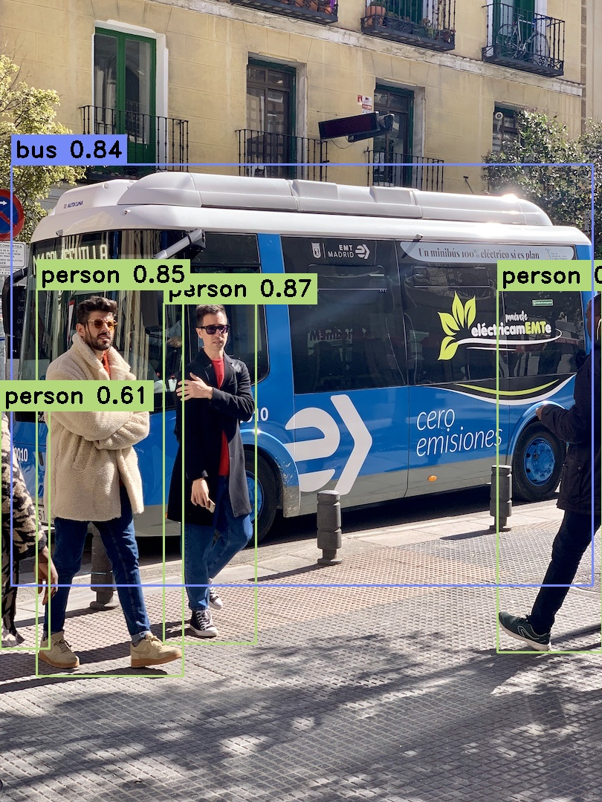

# yolo_tensorrt_inference
yolov5的TensorRT推理，支持单张推理和多图推理。  
## 本机环境配置
RTX 4070 12GB  
TensorRT 8.5.3  
OpenCV4.5.5  
CUDA 11.8   
CUDNN 8.6.0  

## 模型转换
使用Yolov5代码中的export导出engine模型，下面是转换好的模型链接  
链接：https://pan.baidu.com/s/1RlGhxdWV4Zo_U5vDdKDQVQ  
提取码：zj6l  

## 代码
yolov5代码：https://github.com/ultralytics/yolov5 （使用的是7.0版本）  
yolov7和v8的差别主要在后处理，dnn推理的项目中写过https://github.com/Fish0403/yolo_dnn_inference，故此处不再重复

### 效果展示
dnn推理单张图forword花费8ms，最大显存2.1gb；tensorrt推理相同图enqueueV2+拷贝数据约4ms，最大显存1.3gb。

